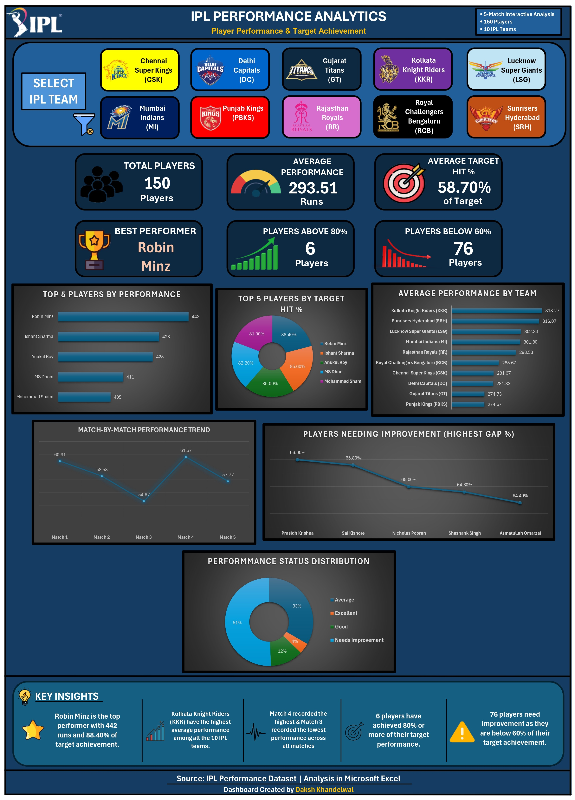
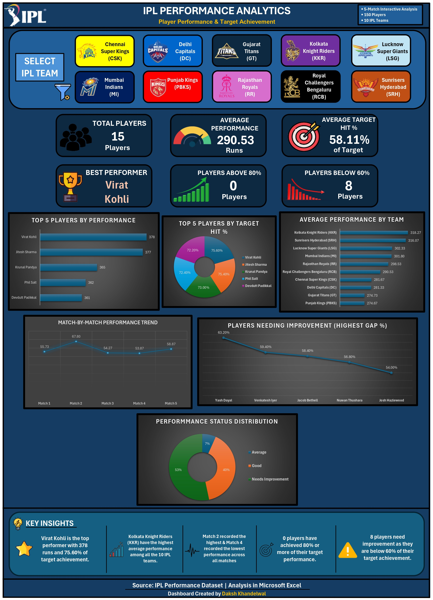

# 🏏 IPL Performance Analytics – Player Performance & Target Achievement

An interactive **Excel-based data analytics dashboard** analyzing player performance and target achievement across all 10 IPL teams, built entirely with PivotTables, dynamic KPI formulas, and VBA-driven interactivity.

---

## 📌 Overview

**IPL Performance Analytics** is an end-to-end Microsoft Excel data analytics project that transforms a raw 150-player, 10-team, 5-match performance dataset into a fully interactive dashboard. The dashboard lets a user click custom, team-branded selection buttons to instantly filter every KPI, chart, and insight to a single team's 15 players — or clear the filter to view the complete 150-player league picture. Beyond the visuals, the project demonstrates a complete analytics workflow: raw data cleaning, PivotTable-based aggregation, dynamic KPI engineering, and VBA automation to bridge a polished custom UI with Excel's native slicer engine.

## 🎯 Project Objective

- Build a recruiter-ready, portfolio-grade analytics dashboard entirely within Excel (no BI tools).
- Convert a raw player-performance dataset into actionable, decision-ready KPIs and visuals.
- Design an interactive, team-based filtering experience that goes beyond Excel's default slicer UI.
- Practice the full analytics lifecycle: data prep → PivotTables → KPI logic → dashboard design → automation → debugging.

## 💡 Problem Statement / Motivation

Raw, tabular IPL performance data is hard to interpret at a glance — team comparisons, target-achievement gaps, and standout/underperforming players are all buried in rows of numbers. This project solves that by turning the dataset into a single-screen, click-to-filter dashboard that surfaces the story behind the numbers: who's performing, who needs improvement, and how each team stacks up — all without leaving Excel.

## 📊 Dataset Overview

| Attribute | Detail |
|---|---|
| Players | 150 |
| Teams | 10 (all current IPL franchises) |
| Matches analyzed per player | 5 |
| Granularity | Player-level performance & target-achievement metrics |
| Analysis levels | Team-wise and player-wise |

**Teams covered:** Chennai Super Kings (CSK), Delhi Capitals (DC), Gujarat Titans (GT), Kolkata Knight Riders (KKR), Lucknow Super Giants (LSG), Mumbai Indians (MI), Punjab Kings (PBKS), Rajasthan Royals (RR), Royal Challengers Bengaluru (RCB), Sunrisers Hyderabad (SRH).

## 🏆 Key Project Statistics (Overall / Default View)

| Metric | Value |
|---|---|
| Total Players | 150 |
| Average Performance | 293.51 runs |
| Average Target Hit % | 58.70% |
| Best Performer | Robin Minz — 442 runs (88.40% target achievement) |
| Players Above 80% Target | 6 |
| Players Below 60% Target | 76 |
| Highest Average Team Performance | Kolkata Knight Riders (KKR) — ~318.27 |

> These figures represent the default 150-player / 10-team view. Selecting any team dynamically recalculates every KPI, chart, and insight for that team's 15 players.

## 🛠️ Tools & Technologies

- **Microsoft Excel** — PivotTables, PivotCharts, formulas, conditional formatting, slicers
- **Excel VBA** — custom button interactivity, slicer automation, error handling
- **Excel Macro-Enabled Workbook (.xlsm)** — required for VBA execution

> This is a pure **Excel + VBA** analytics project. No Power BI, Tableau, SQL, Python, or Machine Learning was used.

## 📁 Excel Workbook Structure

The workbook is organized into five purpose-built sheets, moving from raw data to final visualization:

| Sheet | Purpose |
|---|---|
| `IPL Performance Analytics - Raw` | Original/raw IPL performance dataset |
| `PivotTables` | Pivot tables for player performance, target hit %, team performance, match-wise performance, and player status |
| `KPI Calculations` | Formulas that dynamically calculate every dashboard metric |
| `KPI Dashboard Data` | Dashboard-ready dynamic values and insight text calculations |
| `Dashboard` | The final interactive dashboard |

The final workbook is saved as **macro-enabled (.xlsm)** because VBA powers the custom team-filtering interactions.

## 📈 Dashboard Features

- IPL title/header section with project metadata (150 players, 10 teams, 5-match analysis)
- 10 custom team-selection buttons with team logos, names, and team-specific color themes
- Interactive, VBA-driven team selection with visual active-state highlighting
- A dedicated **clear-filter** control to return to the full 150-player, 10-team view
- Dynamic KPI cards: Total Players, Average Performance, Average Target Hit %, Best Performer, Players Above 80%, Players Below 60%
- Top 5 Players by Performance
- Top 5 Players by Target Hit %
- Average Performance by Team
- Match-by-Match Performance Trend (Match 1–5)
- Players Needing Improvement / Highest Gap %
- Performance Status Distribution (Average / Good / Needs Improvement, with an "Excellent" segment appearing at the overall level)
- Five Dynamic Key Insights that update with the selected filter
- Source and project attribution footer

## 🖱️ Interactive Filtering / Team Selection Mechanism

The default Excel slicer UI was redesigned into **custom visual buttons** — rounded rectangles carrying each team's logo, name, abbreviation, and brand color — for a far more professional, IPL-branded look. Each button (`btn_CSK`, `btn_DC`, `btn_GT`, `btn_KKR`, `btn_LSG`, `btn_MI`, `btn_PBKS`, `btn_RR`, `btn_RCB`, `btn_SRH`) is wired via VBA to drive the underlying `Slicer_Team` slicer cache, so a single click applies the team filter and refreshes every KPI, chart, and insight on the dashboard. A separate clear-filter control resets the view back to all 150 players across all 10 teams.

## ⚙️ VBA Automation

VBA connects the custom buttons to Excel's native slicer engine:

- Each team button calls a dedicated procedure (`SelectCSK`, `SelectDC`, `SelectGT`, `SelectKKR`, `SelectLSG`, `SelectMI`, `SelectPBKS`, `SelectRR`, `SelectRCB`, `SelectSRH`) that selects the corresponding item on `Slicer_Team`.
- A separate procedure handles clearing the active filter.
- The slicer cache and slicer item names were originally identified through the VBA **Immediate Window**.
- Performance settings (`ScreenUpdating`, `EnableEvents`, manual calculation control) were used to reduce the click-to-refresh delay.

## 🧮 KPI Explanation

All KPIs are calculated dynamically in the `KPI Calculations` and `KPI Dashboard Data` sheets, driven by the PivotTables and refreshed automatically whenever the team filter changes:

- **Total Players** — count of players in the current filter context
- **Average Performance** — mean runs across the filtered player set
- **Average Target Hit %** — mean of each player's (performance ÷ target)
- **Best Performer** — dynamically recalculated top scorer for the current filter
- **Players Above 80% / Below 60%** — conditional counts of players hitting or missing target thresholds
- **Highest Gap %** — players furthest from their target, used to flag those needing improvement

## 📊 Charts & Visualizations Used

- Horizontal bar chart — Top 5 Players by Performance
- Donut chart — Top 5 Players by Target Hit %
- Horizontal bar chart — Average Performance by Team
- Line chart — Match-by-Match Performance Trend
- Line chart — Players Needing Improvement (Highest Gap %)
- Donut chart — Performance Status Distribution

## 💡 Dynamic Key Insights

Five insight statements are generated by formula and update automatically with the selected team, for example (overall view):

- Robin Minz is the top performer with 442 runs and 88.40% of target achievement.
- Kolkata Knight Riders (KKR) have the highest average performance among all 10 IPL teams.
- Match 4 recorded the highest and Match 3 recorded the lowest performance across all matches.
- 6 players have achieved 80% or more of their target performance.
- 76 players need improvement as they are below 60% of their target achievement.

## 🧗 Development Challenges & Debugging

Building the dashboard involved genuine iterative problem-solving, including:

1. **Dynamic KPI references** — KPI values initially broke when the dashboard was filtered; references to the PivotTables and `KPI Dashboard Data` sheet had to be corrected.
2. **Percentage formatting** — raw decimal values (e.g., `0.532`) initially displayed incorrectly instead of as `53.2%`.
3. **#REF! error handling** — the "Players Above 80%" KPI threw a `#REF!` error when a selected team had zero qualifying players; this was fixed to display `0` instead.
4. **Dynamic Best Performer** — the KPI needed extra logic to correctly recalculate per selected team rather than staying static.
5. **Custom UI over default slicer** — building branded team buttons instead of relying on Excel's default slicer appearance.
6. **VBA discovery** — the slicer cache name and slicer item names were identified using the VBA Immediate Window before automation could be wired up.
7. **Performance delay** — custom buttons initially introduced a 2–3 second click delay; `ScreenUpdating`, `EnableEvents`, and calculation-mode controls reduced this, and the small residual delay was accepted as non-critical.
8. **VBA runtime errors** — including application/object-defined errors and "item not found" errors, resolved by verifying exact slicer cache, slicer item, and shape names.
9. **Shape naming** — all ten button shapes were correctly identified and renamed in the Selection Pane (`btn_CSK` … `btn_SRH`).
10. **Visual selection state** — the initial highlight/glow effect on selected buttons was refined for a cleaner active-state appearance.
11. **Clear-filter control** — added to reset the dashboard back to the full dataset.
12. **Dynamic insights** — the Key Insights text was engineered to change with the active filter instead of remaining static.
13. **Layout decision** — the dashboard was deliberately built as a vertical layout (rather than forced into 16:9) to support a complete analytical story in one scroll.
14. **File format management** — the workbook was saved across `.xlsx` and `.xlsm` during development; the final macro-enabled `.xlsm` is required for the VBA automation to function.

## 🔑 Results / Major Findings

- **Kolkata Knight Riders (KKR)** posted the highest average team performance (~318.27 runs) across the full dataset.
- **Robin Minz** was the standout overall performer at 442 runs and 88.40% target achievement.
- Only **6 of 150 players** (4%) crossed the 80% target-achievement threshold, while **76 players** (over half) fell below 60% — highlighting a significant target-achievement gap across the league.
- Team averages ranged from ~274.67 (Punjab Kings) to ~318.27 (KKR), showing meaningful team-level performance variation.

## 🖥️ How to Use the Dashboard

1. Open `IPL_Performance_Analytics.xlsm` in Microsoft Excel (macros enabled — see below).
2. On the **Dashboard** sheet, click any of the 10 team buttons to filter every KPI, chart, and insight to that team's 15 players.
3. Click the **clear-filter** icon to return to the full 150-player, 10-team view.
4. Review the Top 5 tables, team comparison chart, match trend, improvement-gap chart, status distribution, and the five Key Insights — all update automatically with your selection.

## 🔐 How to Open the Macro-Enabled Workbook Safely

- Download `IPL_Performance_Analytics.xlsm` from the `workbook/` folder.
- When opening in Excel, click **"Enable Content"** / **"Enable Macros"** on the yellow security banner — this is required for the team-selection buttons to work.
- Only enable macros for files from sources you trust; this workbook contains no external connections, only local VBA that operates on the workbook's own slicer.

## 📂 Project Files Explanation

| File | Description |
|---|---|
| `IPL_Performance_Analytics.xlsm` | **Primary interactive project file** — macro-enabled workbook with full VBA functionality |
| `IPL_Performance_Analytics.pdf` | Final PDF export of the dashboard |
| `IPL_Performance_Analytics_All_10_Teams.jpg` | Screenshot of the complete 10-team / 150-player dashboard view |
| `IPL_Performance_Analytics_RCB_Example.jpg` | Screenshot of a single-team (RCB) filtered dashboard example |
| `IPL_Performance_Analytics_RCB_Example.pdf` | PDF export of the RCB single-team example |

> Backup workbooks created during development are kept locally for version history and are not part of the published repository.

## 🖼️ Screenshots / Dashboard Preview

**Overall IPL Performance Analytics Dashboard – 150 Players / 10 Teams**

**RCB Team-Level Dashboard Example – 15 Players**

## 🚀 Future Improvements

- Add season-over-season comparison once multi-season data is available.
- Introduce a search/lookup box for individual player drill-down.
- Extend the match-trend chart with per-team match filtering.
- Publish an interactive web version (e.g., Power BI or a lightweight web app) as a companion to the Excel dashboard.

## 🧠 Skills Demonstrated

- Excel data cleaning and structuring
- PivotTable & PivotChart-based analysis
- Dynamic KPI formula design
- Dashboard UX/UI design in Excel
- VBA automation and slicer integration
- Debugging and iterative development
- Data storytelling through Key Insights
- End-to-end analytics project documentation

## 👤 Author

**Daksh Khandelwal**
B.S. Applied AI & Data Science
2nd Year
IIT Jodhpur

---

⭐ If you found this project useful or interesting, consider starring the repository!
